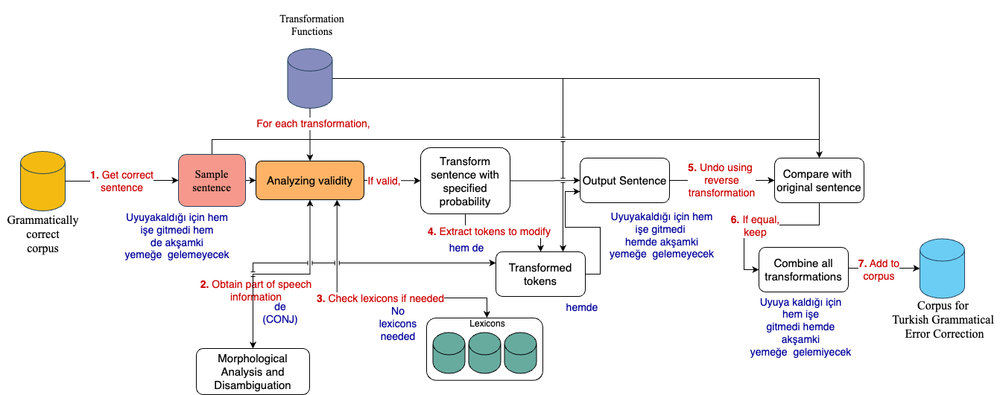

# GECTurk: Grammatical Error Correction and Detection Dataset for Turkish [](https://github.com/atakankara/tr-gec)

This repository contains the implementation for GECTurk; the first extensive dataset and analysis on Grammatical Error Detection (GED) and Grammatical Error Correction (GEC) for Turkish. 

## Table of Contents

1.  [Data Generation Pipeline](#pipeline)
2.  [Datasets](#datasets)
3.  [Tasks & Models](#tasks--models)
4.  [Usage](#usage)
5.  [Extending the Pipeline](#extending)
6.  [Acknowledgement](#acknowledgement)
7.  [Cite](#cite)

## Data Generation Pipeline

<p align="center">

<br>
<small><b>Figure 1: Data generation pipeline. </b></small>
</p>

We present a flexible and extensible synthetic data generation pipeline for Turkish covering 25 expert-curated grammar rules implemented through transformation functions.

The first step in this pipeline involves obtaining a grammatically correct sentence from an existing corpus. Following this, morphological analysis is conducted on the sentence. Next, the validity of the sentence for the transformation function is examined. If the sentence is deemed suitable, the transformation is implemented with a certain probability 'p'. The next phase involves selecting tokens to modify, after which the pipeline checks if reverse transformations can retrieve the original tokens. In case the original cannot be recovered, that particular sentence is dismissed. However, if the original can be recovered, the transformed sentence is consequently added to the corpus.

## Dataset

GECTurk consists of 138K sentences, consisting of 25 different rules, with varying levels of frequency. Here are some samples from GECTurk dataset:

#### Source & Annotation

    S Meclis'i boykot kadar anlamsız bir protesto ola bilir mi?
    A 6 8|||rule_20|||olabilir|||REQUIRED|||-NONE-|||0

#### Target

    Meclis'i boykot kadar anlamsız bir protesto olabilir mi?

-------------------------------------------

#### Source & Annotation

    S Hiç bir haber hiç bir gazeteciye gökten inmez.
    A 0 2|||rule_22|||Hiçbir|||REQUIRED|||-NONE-|||0
    A 3 5|||rule_22|||hiçbir|||REQUIRED|||-NONE-|||0


#### Target

    Hiçbir haber hiçbir gazeteciye gökten inmez.

To further evaluate, we manually annotate a dataset of movie reviews which is also provided in [here](https://drive.google.com/drive/folders/1Ip4vO9Qdl-Bm1mdNwMDjmL9lbTn3xbeP?usp=sharing).
## Tasks & Models

In our work, we focus on two tasks: *Grammatical Error Correction* (GEC) and *Grammatical Error Detection* (GED). 

We use Neural Machine Translation (NMT) (only for GEC), [masked Generative Pre-trained Transformer (mGPT) using prefix-tuning](https://huggingface.co/ai-forever/mGPT), and [sequence tagger pre-trained on Turkish](https://huggingface.co/dbmdz/bert-base-turkish-cased) to evaluate the performance of GECTurk. 


## Usage

Here are the necessary instructions to download and use the datasets, reproduce results, and continue generating data.

> Datasets

The datasets can be downloaded from [here](https://drive.google.com/drive/folders/1Ip4vO9Qdl-Bm1mdNwMDjmL9lbTn3xbeP?usp=sharing). After downloading the dataset, move it to the corresponding dataset directory.

```bash
mkdir datasets
mv <path_to_dataset> datasets/<dataset_name>
```
Where dataset_name is either gec_tr or boun.

> Weights

We provide the weights trained on all data for the NMT, mGPT and sequence tagger in [here](https://drive.google.com/drive/folders/10emM6QxiEidvCtxCdh_MyQ4UD82ay0Wy?usp=sharing). After obtaining the weights, move it to the corresponding folder in the weights directory under the model name.

```bash
mkdir weights weights/<model_name>
mv <weight> weights
```
where model_name can be nmt, mgpt or sequence_tagger.

For each model, a default configuration file is provided in the configs directory. You can change the parameters in the configuration file or create a new one.

> NMT Training and Validation

To train or validate the models, after downloading the [dataset](https://drive.google.com/drive/folders/1Ip4vO9Qdl-Bm1mdNwMDjmL9lbTn3xbeP?usp=sharing) and the weights (for validation) you can use the following commands:

```bash
# an example for training NMT
python nmt_based/train.py --train_config configs/nmt/train.yaml --split gec_tr
```

```bash
# an example for testing NMT
python nmt_based/test.py --test_config configs/nmt/test.yaml --split gec_tr
```
> mGPT Training and Validation

Run this from inside the mGPT folder, not the root folder. The paths for the datasets should be modified as needed inside the `mgpt_generation.py` file. This file will perform all the training, and generate the file for testing. To evaluate for correction, the `m2_scorer` tool should be used from the `utils` folder.

In order to use the `dataset_percentage` with anything other than 1.0, you will need to make your own dataset splits and name them properly.

```bash
cd mGPT
python mgpt_generation.py --dataset_percentage 1.0 --epochs 3 --weights_file weights_name.ckpt --output_file output_file.txt
```

> Sequence-tagger Training and Testing

```bash
# example command for training the sequence-tagger model
python sequence_tagger/train.py --train_config configs/sequence_tagger/train.yaml
```

```bash
# example command for testing the sequence-tagger model
python sequence_tagger/test.py --test_config configs/sequence_tagger/test.yaml

> Generating data

To produce more data, create a text file that contains grammatically correct sentences on each line. Afterward, execute the following command:

```bash
python data_generation/process_sentences.py --source path/to/your/input/sentences --experiment name/of/the/experiment
```

## Extending the Pipeline
### How to add a new rule to the pipeline?

It is fairly simple. You need to implement a transformation and reverse transformation function at the data_generation/rules.py and data_generation/correction_rules.py files respectively. Each transformation function accepts 4 arguments, sentence, morphological_analysis, flags, p and name. You can benefit from the morphological analyzer to implement more sophisticated rules. Any dictionary you may need should be added to data_generation/dictionaries.py file. 

### How to add new languages?

You should begin by curating a list of sentences that are grammatically correct. Following this, create transformation functions pertaining to the specific grammar rules you desire, and also develop their corresponding reverse transformation functions. Lastly, incorporate a new morphological analyzer for the target language.

## Acknowledgement

- Supported by the [Scientific and Technological Research Council of Türkiye (TÜBİTAK)](https://www.tubitak.gov.tr/) as part of the project *Automatic Learning of Procedural Language from Natural Language Instructions for Intelligent Assistance* with the number 121C132. 
- We gratefully acknowledge [KUIS AI Lab](https://ai.ku.edu.tr/) for providing computational support. 
- We thank our anonymous reviewers and the members of GGLab who helped us improve this paper.

## Citing

TBA


Contact: Atakan Kara, akara18@ku.edu.tr

Please send us an e-mail or report an issue, if something is broken or if you have further questions.
